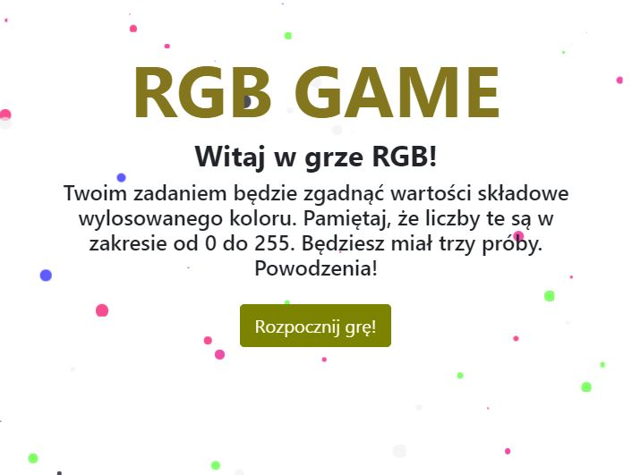
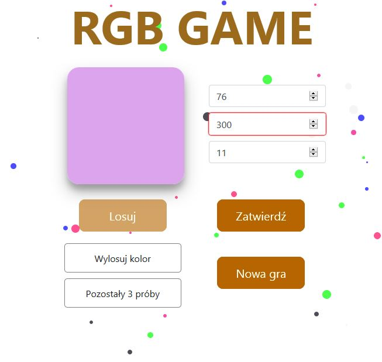

# RGB-Guess-Game
> Guess the RGB value of random generated color with GUI

## Table of contents
* [General info](#general-info)
* [Screenshots](#screenshots)
* [Technologies](#technologies)
* [Features](#features)
* [Status](#status)
* [Contact](#contact)

## General info
First game project created as part of learning the basics of JavaScript based on functional programming.

## Screenshots

## Technologies
* JavaScript
* Bootstrap

## Features
List of features ready and TODOs for future development
* 3 attempts to guess the color
* Possible scores: 0-100 points
* Dynamically changing color of the text

To-do list:
- [ ] best scores ranking
- [ ] additional box for user's selected color

## Status
Project is: _in progress_

## Contact
Created by [@zielinp](https://www.linkedin.com/in/zielinp/) - feel free to contact me!
